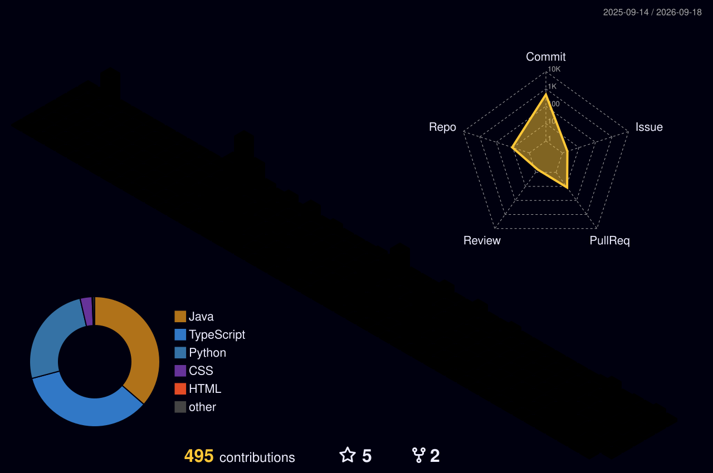

# Gayul Kim

**어제보다 나은 내일을 위해 꾸준히 기록하고 성장합니다.**

---

### 🌱 My Contribution Garden

---

### 🔭 What I'm Working On

> **레거시를 안전하게 걷어내고, 문제가 생겼을 때 빠르게 원인을 찾을 수 있는 시스템을 지향합니다.**

**🌱 레거시 현대화**

- Spring Framework 3.x / Java 7 기반 서비스를 **Spring Boot 3.x / Java 17**로 단계별 이관 — 설계부터 운영 배포·안정화까지
- XML 빈 설정을 Java Config로 전환하고, JSP 화면 흐름에서 REST API 계층을 분리

**🔐 인증과 보안**

- SAML 기반 SSO 인증 도입 및 Spring Security 6 필터 체인 재구성
- 로그 민감정보 마스킹 · 파일 다운로드 경로 검증 · 프론트엔드 라이브러리 CVE 해소

**📈 관측성과 안정화**

- 요청 단위 traceId(MDC) 구조화 로깅 도입 — 응답 헤더의 ID 하나로 로그를 추적할 수 있게
- 오분류되던 예외를 정리해 운영 알람 노이즈를 줄이고, 종료 스크립트에 Graceful Shutdown 적용
- 불필요한 JOIN을 걷어낸 조회 쿼리 개선, 재현 테스트를 동반한 NPE 방어

**✍️ 기록과 도구**

- 트러블슈팅과 개선 과정을 기술 블로그에 정리합니다. AI를 개발 흐름에 붙여 반복 작업을 줄이는 데 관심이 있습니다.

---

### 🛠️ In My Tech Stack

**Backend**

**Database**

**Cloud & Infrastructure**

**Auth & Security**

**Frontend**

**Tools**

**AI & Prompt Engineering**

---

### 📝 Latest Blog Posts

<!-- BLOG-POST-LIST:START -->
📅 `2026.08.21` : 📝 **[&zwj;  유니버설 링크 함정 도감 ① 설계와 값 &mdash; 전부 에러가 안 납니다](https://yurizzy.tistory.com/272)**

📅 `2026.08.10` : 📝 **[백엔드 개발자가 반드시 잡는 예외 모음 (feat. IDE가 시키는 try~catch 탈출)](https://yurizzy.tistory.com/271)**

📅 `2026.08.09` : 📝 **[네트워크 타임아웃 예외가 발생하는 원리 (feat. ConnectException, SocketTimeoutException)](https://yurizzy.tistory.com/270)**

📅 `2026.07.24` : 📝 **[자바 Executor 프레임워크로 스레드 풀 다루기 (feat. ThreadPoolExecutor)](https://yurizzy.tistory.com/269)**

📅 `2026.05.20` : 🚀 **[&zwj;  Springframwork Mig 기록 - GitLab CI/CD 빌드 환경 맞추기 (feat. Gradle 프로필 빌드)](https://yurizzy.tistory.com/268)**

📅 `2026.05.16` : 📖 **[주니어 백엔드 개발자가 반드시 알아야 할 실무 지식 : 신입이 알아야 할 DB 성능&middot;풀스캔&middot;인덱스 9가지](https://yurizzy.tistory.com/267)**

📅 `2026.04.28` : 🚀 **[&zwj;  Springframwork Mig 기록 : 화면에는 없는데 서버에는 필요한 값들 (feat. 세션 기반 파라미터)](https://yurizzy.tistory.com/266)**

📅 `2026.04.23` : 📝 **[⚡️개발자가 자주 사용하는 NANO명령어 (알쓸나잡) : Vim 유저도 당황하지 않는 Nano 편집기 완벽 가이드 (설정부터 커스텀까지)](https://yurizzy.tistory.com/265)**

📅 `2026.04.22` : 📝 **[⚡️개발자가 자주 사용하는 VIM 명령어 모음 : 알아두면 쓸데있는 Vim 잡학지식(알쓸빔잡)](https://yurizzy.tistory.com/264)**

📅 `2026.04.20` : 📖 **[️ 실무 : StrictHttpFirewall이 동작하는 원리 (feat. PROPFIND, WebDAV) | PROPFIND가 뭐예요 ?](https://yurizzy.tistory.com/263)**

<!-- BLOG-POST-LIST:END -->

---

### 📫 Contact Me

---

 

### _"꾸준함이 재능을 이긴다" - Keep learning, Keep growing 🌱_

 
 

